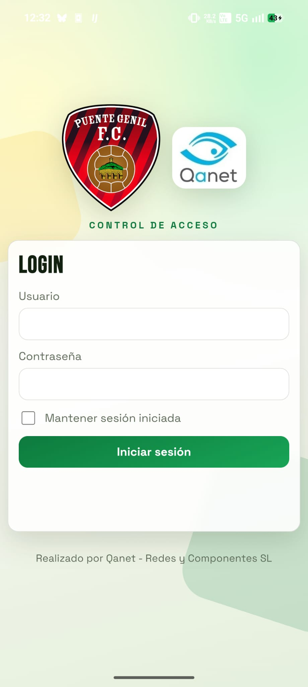
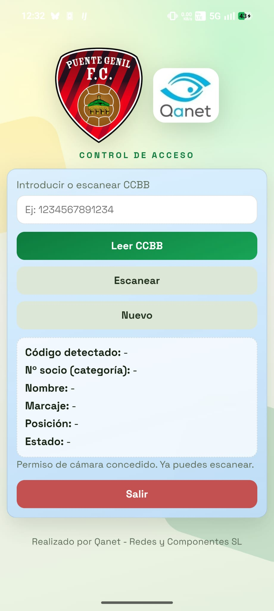
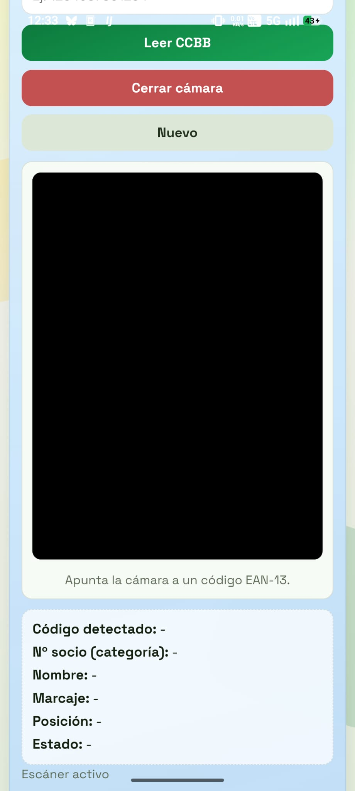
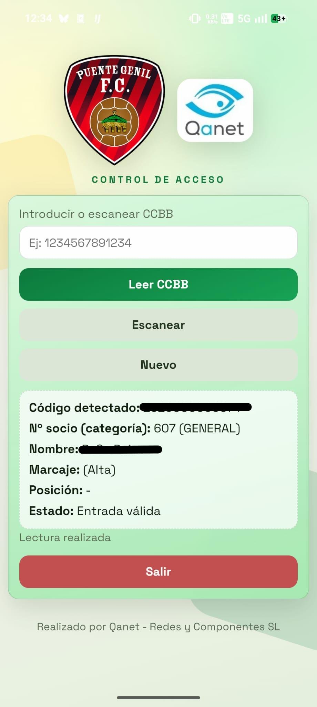
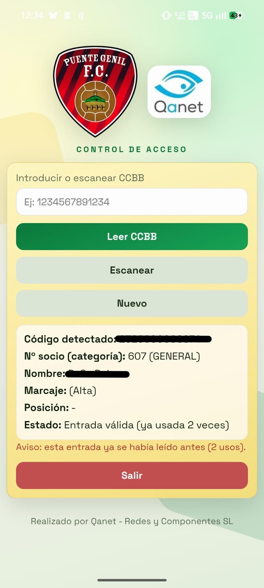
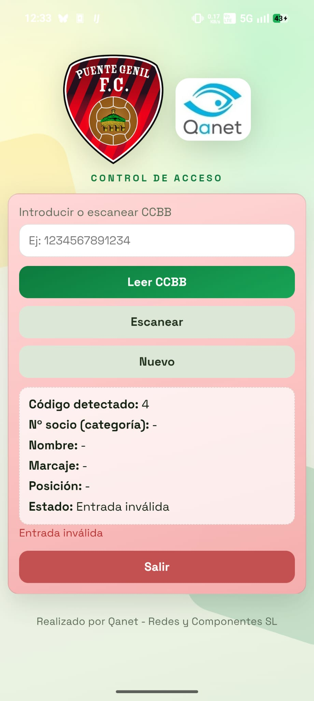

# Salerm App — Control de Acceso

Sistema de control de acceso para eventos del **Puente Genil F.C.**, desarrollado por **Qanet - Redes y Componentes SL**. Dev. Javier Rider Jimenez

---

## Descripción

Salerm App es una aplicación web progresiva (PWA) empaquetada como app nativa Android mediante Capacitor. Permite al personal de control de acceso verificar entradas de socios en tiempo real, escaneando códigos de barras con la cámara del dispositivo, mediante scaner de codigo de barras o  introduciéndolos manualmente.

---

## Capturas de pantalla

### Login



### Lector limpio



### Escaner activo



### Entrada valida



### Entrada ya usada



### Entrada invalida



---

## Funcionalidades principales

- **Login con sesión persistente** — Opción de mantener la sesión iniciada entre usos.
- **Lectura manual** — Introduce el código CCBB directamente desde el teclado.
- **Escáner de cámara** — Detección automática de códigos mediante la API `BarcodeDetector` del navegador.
- **Múltiples formatos de código de barras soportados:**
  - EAN-13, EAN-8
  - Code 128, Code 39, Code 93
  - Code 23 / Codabar
  - ITF (Interleaved 2 of 5)
  - UPC-A, UPC-E
  - QR Code, Data Matrix, PDF417, Aztec
- **Resultado visual inmediato** 
  - Nombre
  - Nº de socio,
  - Categoría,
  - Marcaje
  - Posición
  - Estado de la entrada.
- **Indicador de estado** — Retroalimentación visual
  - Entrada válida -> Verde
  - Ya utilizada -> Amarillo
  - Invalida -> Rojo

---

## Tecnologías

| Capa               | Tecnología                                 |
| ------------------ | ------------------------------------------- |
| Frontend           | HTML5 · CSS3 · JavaScript ES Modules      |
| Bundler            | [Vite](https://vite.dev/) 5.x                  |
| App nativa Android | [Capacitor](https://capacitorjs.com/) 7.x      |
| Fuentes            | Google Fonts — Bebas Neue · Space Grotesk |

---

## Requisitos

- **Node.js** 18 o superior
- **Android Studio** (para compilar la app Android)
- **JDK 17** o superior

---

## Instalación y desarrollo

```bash
# Instalar dependencias
npm install

# Servidor de desarrollo local
npm run dev

# Compilar para producción y sincronizar con Android
npm run build
npx cap sync
```

---

## Compilar la app Android

```bash
# Abrir el proyecto en Android Studio
npm run cap:android
```

Desde Android Studio: **Build → Generate Signed Bundle / APK** para obtener el instalador.
Copia el `.apk` resultante a la carpeta `releases/` con el nombre `salerm-app-vX.Y.Z.apk` y actualiza la tabla de versiones anterior.

---

## Estructura del proyecto

```
├── index.html              # Estructura HTML de la app
├── src/
│   ├── main.js             # Lógica principal (autenticación, escáner, API)
│   └── styles.css          # Estilos
├── media/
│   ├── Puente Genil F.C.png
│   └── Qanet.png
├── android/                # Proyecto Android generado por Capacitor
├── capacitor.config.ts     # Configuración de Capacitor
└── vite.config.js          # Configuración de Vite
```

---

## API

La app se comunica con el endpoint:

```
https://www.qmobile.es/salerm/app/index.php
```

Los parámetros y la autenticación se gestionan desde `src/main.js`.

---

## Créditos

Desarrollado por **[Qanet - Redes y Componentes SL](https://www.qanet.es)**
para el **Puente Genil F.C.
Dev -** Javier Rider Jimenez
